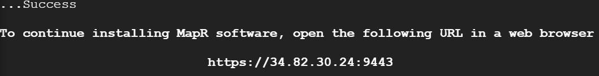
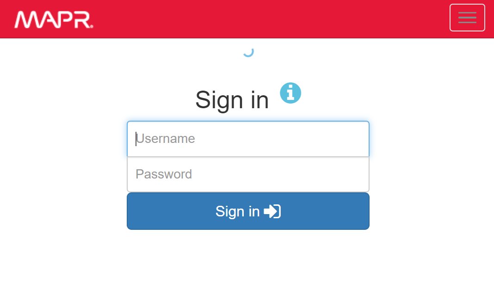
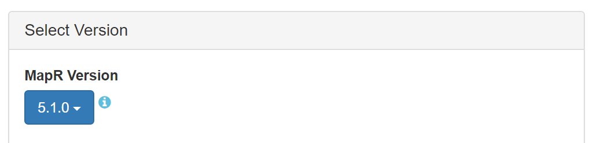
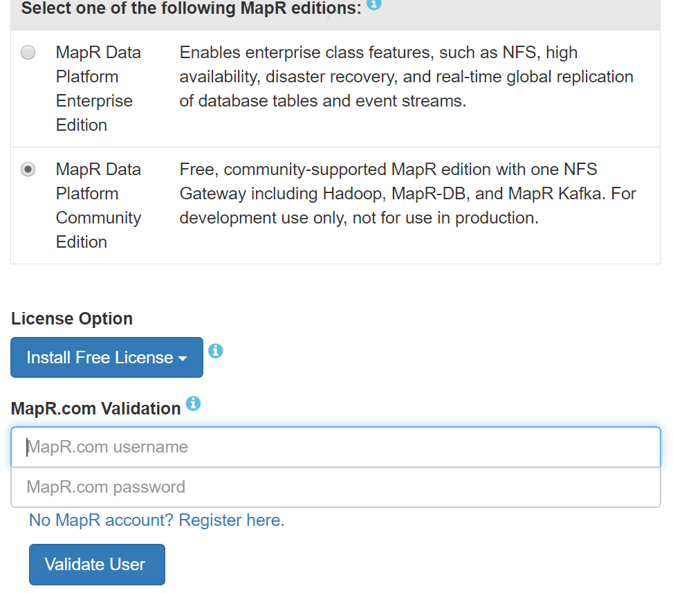
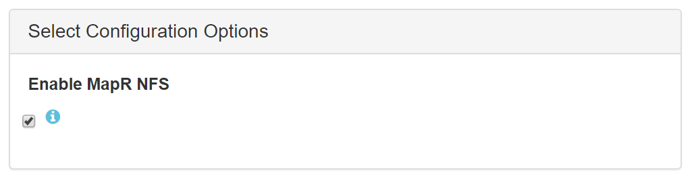
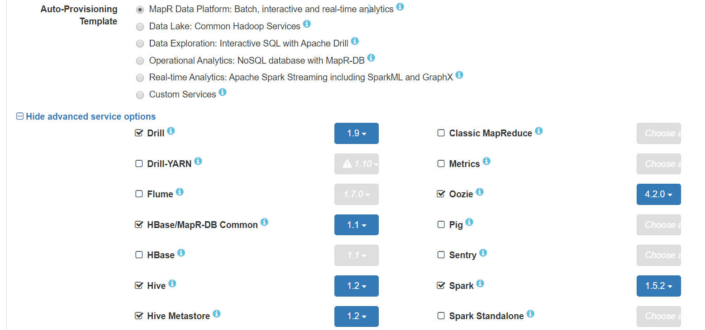
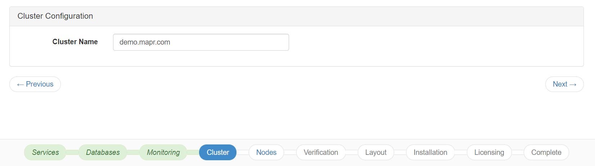
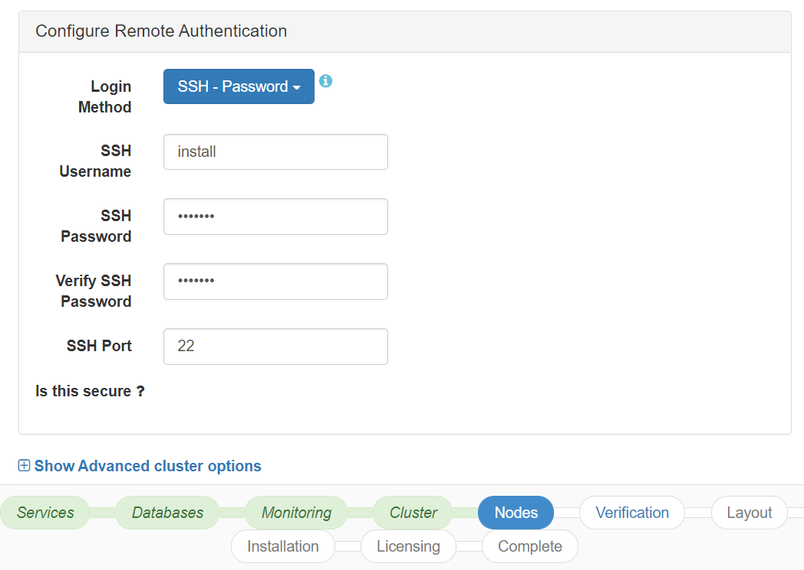
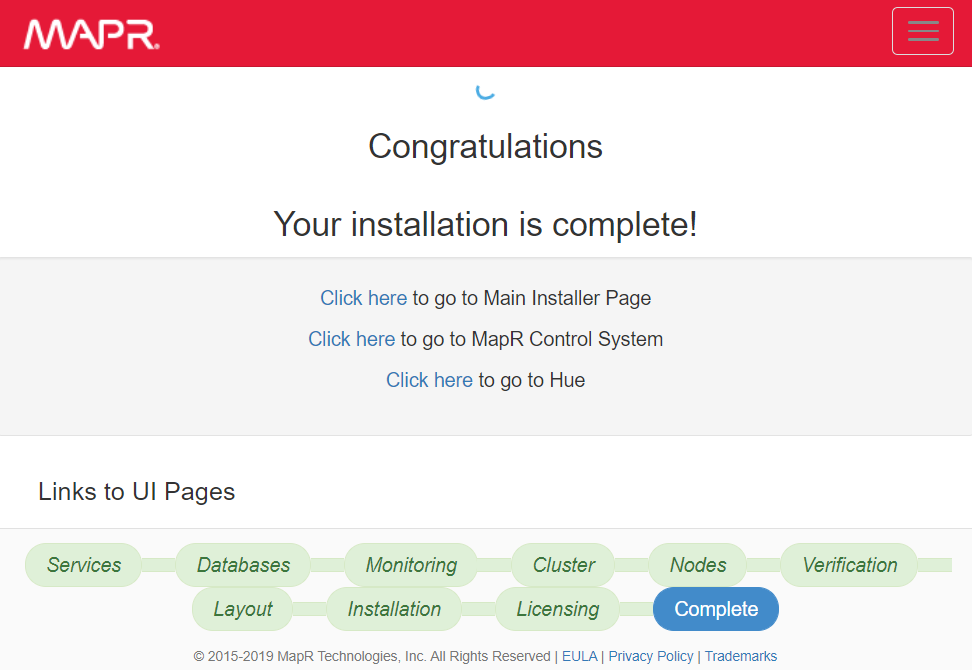
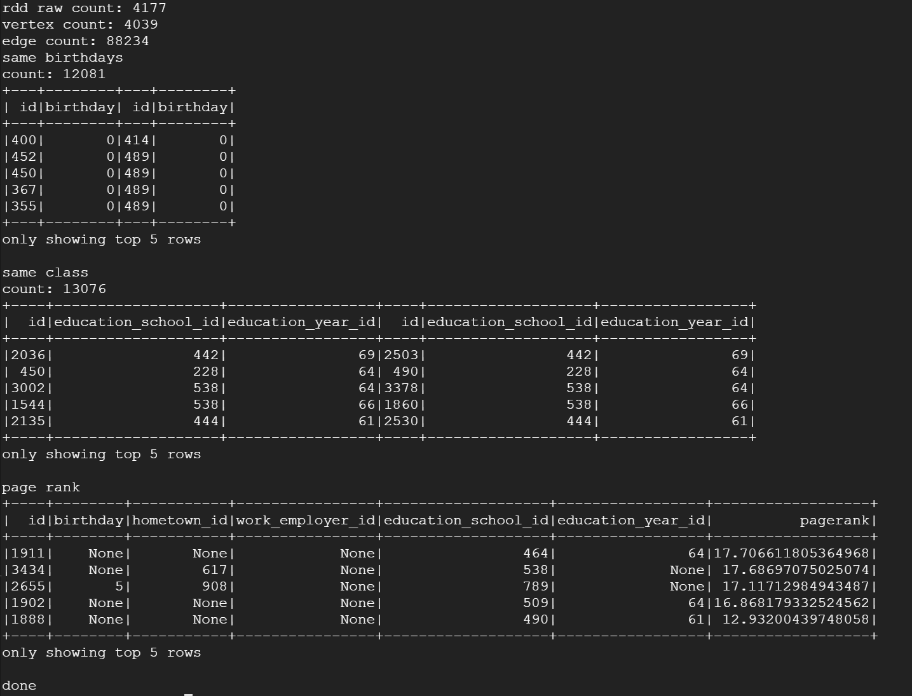

# MAPR-installation-procedure-tutorial

This tutorial shows how to install an old version of MAPR (5.1.0) to run this example https://mapr.com/blog/using-spark-graphframes-analyze-facebook-connections/    (Using Spark GraphFrames to Analyze Facebook Connections)


## Create Google Cloud VPS
<p align="center"></p>

>Create a machine with 52GB of memory (the suggested value by MAPR is 64GB)
 
<br>

>Select Ubuntu 14 because MAPR (5.1.0) only support older version of ubuntu, then increase the disk size to 300 GB
 
<br>

>Check Allow Http traffic, Allow Https traffic.
>Create an additional harddisk with 500GB.
 


## Download and setup MAPR
>run the following commands in ubuntu14 shell
```sh
sudo su -

wget https://package.mapr.com/releases/installer-v1.11.0/mapr-setup.sh 
wget http://archive.mapr.com/releases/installer-v1.11.0/ubuntu/mapr-installer-definitions_1.11.0.0.201902141709_all.deb
wget http://archive.mapr.com/releases/installer-v1.11.0/ubuntu/mapr-installer_1.11.0.0.201902141709_all.deb

bash mapr-setup.sh -i mapr-installer_1.11.0.0.201902141709_all.deb mapr-installer-definitions_1.11.0.0.201902141709_all.deb
```

>setup Success message:

 
<br>

>The installation webpage will appear when your Click on the link appeared in the message:

 
<br>


## Linux Configuration before MAPR packages installation
Before the installation we should go back to the command line and config the ubuntu to accept password authetication by editing the file /etc/ssh/sshd_config with:
```sh
nano /etc/ssh/sshd_config 
```
locate the parameter PasswordAuthentication and set it to yes, then press control + x to save and exit
```sh
PasswordAuthentication yes
```
restart the ssh service
```sh
service ssh restart
```

then, we need to create a sudo user which will be used in MAPR to install the packages:
```sh
adduser install
usermod -aG sudo install
```

## MAPR installation

 
 
 
 
 
 
 

## Running SPARK with GraphFrame

```sh
su - mapr
wget https://snap.stanford.edu/data/facebook.tar.gz
wget https://snap.stanford.edu/data/facebook_combined.txt.gz
wget https://snap.stanford.edu/data/readme-Ego.txt
tar xvfz facebook.tar.gz -C /mapr/demo.mapr.com/user/mapr --strip 1
gunzip -c facebook_combined.txt.gz > facebook_combined.txt
mv facebook_combined.txt /mapr/demo.mapr.com/user/mapr
```

```sh
wget https://raw.githubusercontent.com/mapr-demos/spark-graphframes/master/gframes.py
```

```sh
/opt/mapr/spark/spark-1.5.2/bin/spark-submit --packages graphframes:graphframes:0.1.0-spark1.5,com.databricks:spark-csv_2.11:1.4.0 gframes.py
```
 
<!--- 
>I hope this tutorial will save your time.  (I spent 3 days with a lot of struggles, and finally I made it work.) 
--->