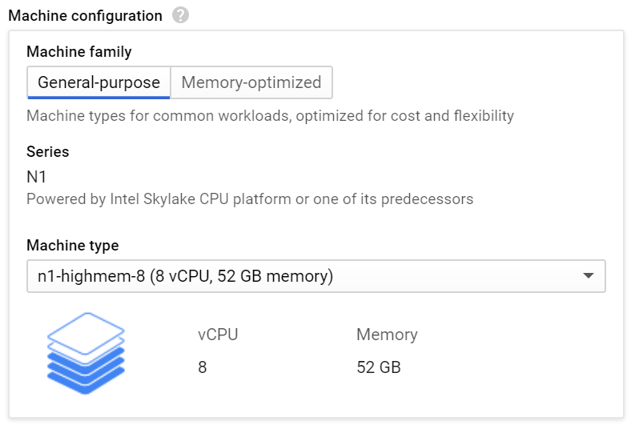
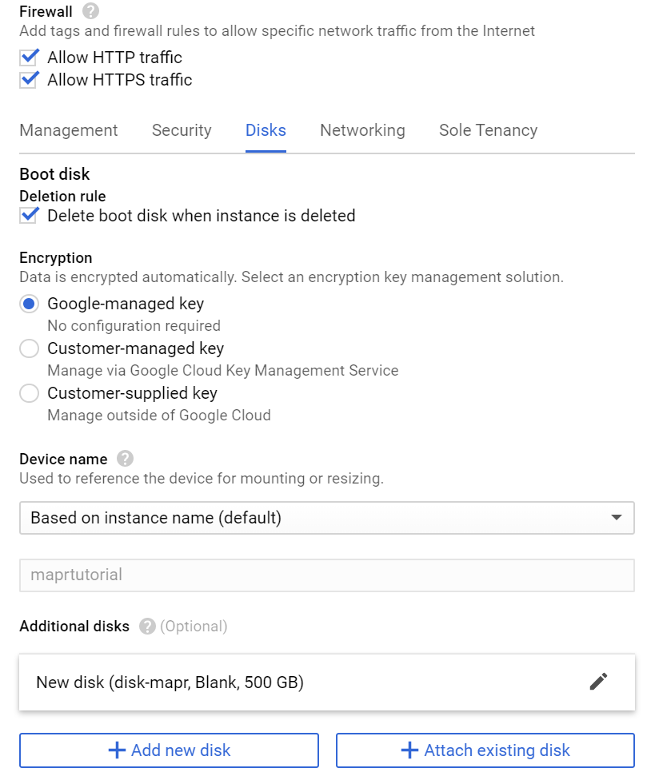

# MAPR-installation-procedure-tutorial
This tutorial shows how to install an old version of MAPR (5.2.0) to run this example https://mapr.com/blog/using-spark-graphframes-analyze-facebook-connections/    (Using Spark GraphFrames to Analyze Facebook Connections)

## Create Google Cloud VPS
<p align="center"></p>

>Create a machine with 52GB of memory (the suggested value by MAPR is 64GB)
 

>Select Ubuntu 14 because MAPR (5.2.0) only support older version of ubuntu, then increase the disk size to 300 GB
 

>Check Allow Http traffic, Allow Https traffic.
Create an additional harddisk with 500GB.
 


## Download MAPR
> run the following commands in ubuntu14 shell
```sh
sudo su -

wget https://package.mapr.com/releases/installer-v1.11.0/mapr-setup.sh 
wget http://archive.mapr.com/releases/installer-v1.11.0/ubuntu/mapr-installer-definitions_1.11.0.0.201902141709_all.deb
wget http://archive.mapr.com/releases/installer-v1.11.0/ubuntu/mapr-installer_1.11.0.0.201902141709_all.deb

bash mapr-setup.sh -i mapr-installer_1.11.0.0.201902141709_all.deb mapr-installer-definitions_1.11.0.0.201902141709_all.deb
```
## Linux Configuration before MAPR installation

## MAPR installation

## Running SPARK with GraphFrame
